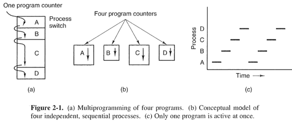
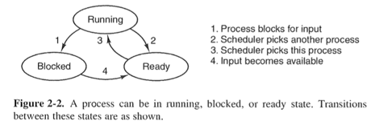
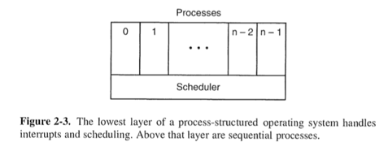
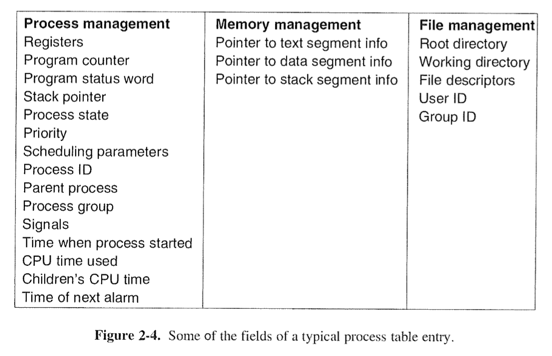
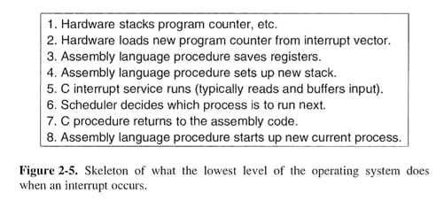

# Chapter 2 Process and Threads

@(Morden Operating System)[OS|Book Review]

--------------------------------------------------

[TOC]

--------------------------------------------------

### 2.1 Processes 
**Process** (or Sequential Process) is an instance of an executing program including the current value of *PC*, *registers* and *variables*.

**Daemons** : background process, not associated with users, waiting for activities

#### Process Creation
- System initialization
- Execution of a process-creation-system-call by a running process
- User request to create a new process
- Initiation of a batch job : mainframe create a new process to run the batch job submitted by user

> All these cases, a new process is created by having an existing process execute a process creation system call. 
> In Unix, there is only one system call to create process : `fork`. This call creates an exact clone of the calling process. (same memory image, environment strings and open files) The child process execute `execve` system call to change its memory image.
> In windows, Win32 function call, `CreateProcess` handle both creation and loading.

#### Process Termination
- Normal exit
- Error exit
- Fatal exit (involuntary)
- Killed by another process (involuntary)

> System call, `exit` (in UNIX) and `ExitProcess` (in windows) is for normal exit.
 
#### Process Hierarchies 
**Process Group** : a process and all of its children and further descendants form a process group.

> In Unix, the system start with one process, `init`. When it is running, it forks off a new process per-terminal. Thus all process in the system belong to a single tree with `init` as the root.
> In Windows, there is no concept of process hierarchy. When a process is created, the parent is given a special token, `handle`, used to control the child. Process is free to pass the `handle` to other process.

#### Process States
- Running (using the CPU)
- Ready (runnable, but temporarily stopped)
- Blocked (unable to run until some external event happens)

> The lowest level of the OS is the `scheduler`, with a variety of process on top of it. All the interrupt handling and details of actually starting and stopping processes are hidden away in `scheduler`. The rest of the operating system is structured in process form. 

#### Implementation of Process
**Process Table** (process control blocks) with one entry per-process. Information used when process is switched from *running* to *blocked* state.

**Interrupt Vector** : a location (typically at a fixed location near the bottom of memory) associated with each I/O class. It contains the address of the interrupt service procedure.
> Suppose process p1 is running when a disk interrupt happens. P1's PC, PSW, and registers are pushed onto the stack by the **interrupt hardware**. The computer then jumps to the address specified in the interrupt vector. It is then up to the interrupt service procedure.

**Interrupt Handling and Scheduling**
All interrupts start by saving the registers of current process into the process table entry. The stack pointer is set to point to a temporary stack used by the process handler.
> Actions such as saving the register and setting the stack pointer cannot be expressed in high-level language like C. They are written by assembly language.
When assembly language routine is finished, it calls a C procedure (system procedure) to do the rest of the work for this interrupt type. Then the scheduler is called to select process to run next. After that, control is passed back to the assembly routine to load registers and memory map for the now-current process.

#### Modeling Multiprogramming

